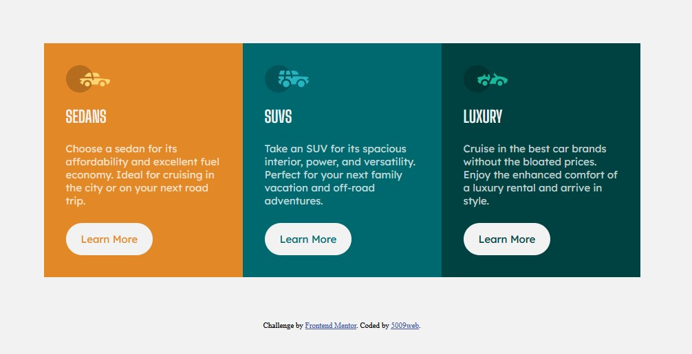

# Frontend Mentor - 3-column preview card component solution

This is a solution to the [3-column preview card component challenge on Frontend Mentor](https://www.frontendmentor.io/challenges/3column-preview-card-component-pH92eAR2-). Frontend Mentor challenges help you improve your coding skills by building realistic projects. 

## Table of contents

- [Overview](#overview)
  - [The challenge](#the-challenge)
  - [Screenshot](#screenshot)
  - [Links](#links)
- [My process](#my-process)
  - [Built with](#built-with)
  - [What I learned](#what-i-learned)
  - [Continued development](#continued-development)
  - [Useful resources](#useful-resources)
- [Author](#author)

## Overview

### The challenge

Users should be able to:

- View the optimal layout depending on their device's screen size
- See hover states for interactive elements

### Screenshot

### Links

- Solution URL: [] (https://github.com/5009web/I-can-t-believe-this-happened-.git)
- Live Site URL: 

## My process
  1. Build out html and add classes.
  2. Add colors, fonts, backgrounds.
  3. Use flex box.

### Built with

- Semantic HTML5 markup
- CSS custom properties
- Flexbox
- VS Code 

### What I learned

I have a long way to go!

 1. Used variables
 2. Media query 
 3. Google fonts
 4. flex box
 5. :hover 
 6. Visual studio code 
 7. Git
 8. Make a README
 9. Submit a project on Frontend Mentor

### Continued development

Need to learn how to: 
  1. Better organize html and css. 
  2. Make better class names with some sort of system.
  3. Use Flexbox.
  4. Mobile first.
  5. Use Git

### Useful resources

- Google - [] (https://www.google.com) 
- W3 Schools - [] (https://www.w3schools.com/) 

## Author

- 5009web - 

